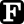

# **Caio E. Stringari, PhD**

<!--
**caiostringari/caiostringari** is a ✨ _special_ ✨ repository because its `README.md` (this file) appears on your GitHub profile.

Here are some ideas to get you started:

- 🔭 I’m currently working on ...
- 🌱 I’m currently learning ...
- 👯 I’m looking to collaborate on ...
- 🤔 I’m looking for help with ...
- 💬 Ask me about ...
- 📫 How to reach me: ...
- 😄 Pronouns: ...
- ⚡ Fun fact: ...
-->

 |  |  | 
:-------------------------------------:|:-----------------------------------------:| :---------------------------------------------:| :-------------------------------------------:
[Email](mailto:caio.stringari@gmail.com) | [Linkedin](https://www.linkedin.com/in/caiostringari/) | [Google Scholar](https://scholar.google.ca/citations?user=03E9NhEAAAAJ&hl=en) | [Research Gate](https://www.researchgate.net/profile/Caio_Eadi_Stringari)

I am an Earth Scientist 🌎 (PhD, University of Newcastle, 🇦🇺) with a background in  physical oceanography (B.Sc., Federal University of Rio Grande, 🇧🇷). I am specialized in using machine learning and data-driven techniques to solve challenging environmental problems. My work so far focused mainly to study  waves 🌊 processes such as wave breaking, energy dissipation, and wave-wave interactions - which have several coastal and ocean engineering applications. I program mostly in  `python` but can work proficiently with   `fortran`,  `octave`/`matlab` and (occasionally)  `C++`.
